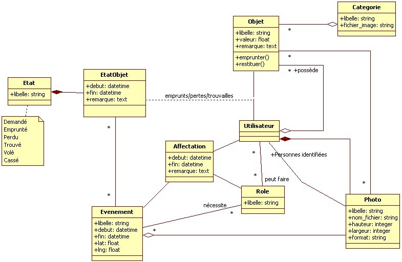

cmsii2013
=========



Projet étudié en cours en 2013.

Sur GitHub, vous pouvez comparer les versions des fichiers, pour voir ce qui a changé d'une séance à l'autre.

N'oubliez pas d'écrire vos inflexions si besoin avant de générer vos classes ! (dans config/initialiers/inflexions.rb)

Pour générer la classe Categorie
```
rails g scaffold categorie libelle fichier_image
```
Pour créer la classe Objet
```
rails g scaffold objet libelle valeur:float
```

Pour lancer un serveur sur le port 8080
```
rails s -p 8080
```

Pour ajouter la colonne categorie_id dans la table objets
```
rails g migration add_categorie_id_to_objets categorie_id:integer
```

Utilisation du collection_select
---
```ruby
  <%= f.collection_select :cle_etrangere_id, ClasseALister.all, :id, :champ_a_afficher_dans_le_select %>
```


Gestion des sous-formulaires (ou formulaires nichés)
---

1. Ajouter la GEM nested_form à votre fichier Gemfile
2. lancer la commande `rails g nested_form:install`

Les formulaires contenant des sous-formulaire doivent utiliser le helper `nested_form_for` au lieu de `form_for`.

Définissez que votre objet principal, celui qui en contient un autre, peut avoir des attributs nichés :

```ruby
  # app/models/objets_principal.rb
  class ObjetPrincipal < ActiveRecord::Base
    has_many: sous_objets
    accepts_nested_attributes_for :sous_objets, allow_destroy: true
  end
```

Utilisez ensuite `<%= f.fields_for :la_relation %>` dans la vue d'édition (`_form.html.erb`) et créez un partial `_la_relation_fields.html.erb` qui affichera de quoi modifier chaque objet de la relation.